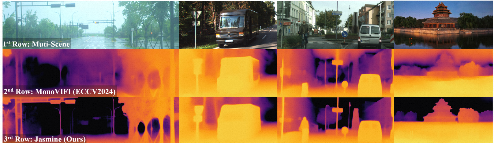
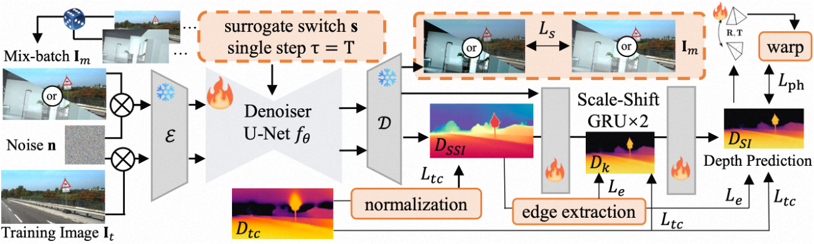
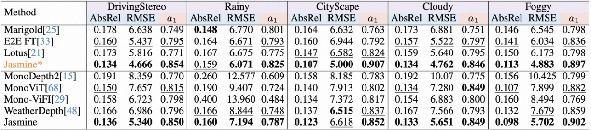

<div align="center">
<h2> Jasmine: Harnessing Diffusion Prior for Self-Supervised Depth Estimation</h2>

<a href='https://wangjiyuan9.github.io/' target='_blank'>Jiyuan Wang</a><sup>1</sup> • 
<a href='https://scholar.google.com/citations?hl=zh-CN&user=t8xkhscAAAAJ' target='_blank'>Chunyu Lin</a><sup>1,†</sup> • 
<a href='#' target='_blank'>Cheng Guan</a><sup>1</sup> • 
<a href='https://scholar.google.com/citations?hl=zh-CN&user=vo__egkAAAAJ' target='_blank'>Lang Nie</a><sup>4</sup>
<a href='#' target='_blank'>Jing He</a><sup>3</sup> • 
<a href='#' target='_blank'>Haodong Li</a><sup>3</sup> • 
<a href='https://kangliao929.github.io/' target='_blank'>Kang Liao</a><sup>2</sup> • 
<a href='https://faculty.bjtu.edu.cn/5900/' target='_blank'>Yao Zhao</a><sup>1</sup>

<sup>1</sup>BJTU • <sup>2</sup>NTU
<sup>3</sup>HKUST • <sup>4</sup>CQUPT
<sup>†</sup>Corresponding author


[](https://arxiv.org/abs/2503.15905) 
[](https://wangjiyuan9.github.io/jasmine/)
[](https://huggingface.co/exander/Jasmine)
[](https://www.bilibili.com/video/BV1x8xszFEos)
[](https://www.youtube.com/watch?v=M314fHXVPOo)

<div style="text-align:center">

</div>
</div>

## 📢 News

- **[2025-03]** 🎉 Paper released on arXiv!
- **[2024-09]** 🎉 Jasmine is accepted to NeurIPS 2025!
- **[2025-10]** 🎉 Code and pretrained models released!

## 🔥 Highlights

**Jasmine** is the first framework that successfully integrates Stable Diffusion (SD) into self-supervised monocular depth estimation (SSMDE). Without any high-precision depth supervision, Jasmine achieves remarkably detailed and accurate depth estimation results through zero-shot generalization across diverse scenarios.

<div style="text-align:center">

</div>

## 🛠️ Environment Setup

Download the pre-configured conda environment from [HuggingFace](https://huggingface.co/exander/Jasmine/blob/main/jasmine.tar.gz):

```bash
# Download the conda-packed environment
wget https://huggingface.co/exander/Jasmine/resolve/main/jasmine.tar.gz
# Create directory and extract
mkdir -p ~/miniconda3/envs/jasmine
tar -xzf jasmine.tar.gz -C ~/miniconda3/envs/jasmine
# Activate the environment
conda activate jasmine
```

**Tested Environment:**
- Python 3.10.12, PyTorch 2.2.0+cu118, CUDA 11.8, Ubuntu 22.04 LTS, GeForce RTX A6000

## 🖼️ Dataset Preparation

### KITTI Dataset

Download KITTI Raw dataset and depth annotations from the [official website](http://www.cvlibs.net/datasets/kitti/raw_data.php).

The dataset should be organized as follows:

```
kitti/
├── 2011_09_26/
│   ├── 2011_09_26_drive_0002_sync/
│   │   └── image_02/
│   │       └── data/
│   └── ...
├── 2011_09_26_drive_0002_sync/
│   └── proj_depth/
│       └── groundtruth/
│           └── image_02/
├── 2011_09_28/
├── 2011_09_29/
├── 2011_09_30/
├── 2011_10_03/
└── gt_depths.npy
```

### DrivingStereo Dataset

Download DrivingStereo dataset from the [official website](https://drivingstereo-dataset.github.io/).

The dataset should be organized as follows:

```
drivingstereo/
├── foggy/
│   ├── left-image-full-size/
│   └── depth-map-full-size/
├── cloudy/
├── rainy/
└── sunny/
```

## 💾 Pretrained Model and Evaluation

### Download Pretrained Model

Download the pretrained model from [HuggingFace](https://huggingface.co/exander/Jasmine):

```bash
# Download the model checkpoint
wget https://huggingface.co/exander/Jasmine/resolve/main/Jasmine.zip
unzip Jasmine.zip -d ckpt/
```

### Evaluation

Example command to evaluate on KITTI Eigen split:

```bash
python trains.py --only_test --eval_split eigen \
    --ug --link_mode first \
    --data_path /path/to/your/data \
    --resume_from_checkpoint ./ckpt
```

To evaluate on other datasets, simply change the `--eval_split` argument:
- `eigen`: KITTI Eigen split
- `foggy_stereo`: DrivingStereo Foggy subset
- `cloudy_stereo`: DrivingStereo Cloudy subset
- `rainy_stereo`: DrivingStereo Rainy subset
- `sunny_stereo`: DrivingStereo Sunny subset

### Quantitative Results

#### KITTI Eigen Split

<!-- TODO: Add KITTI results image -->


#### Zero-shot Generalization

<!-- TODO: Add zero-shot generalization results image -->


For detailed quantitative and qualitative results, please refer to our [paper](https://arxiv.org/abs/2503.15905) and [project page](https://wangjiyuan9.github.io/jasmine/).

## ⏳ Training

**[TBD]** Training code and instructions will be released soon.

## 🎓 Citation

If you find our work helpful, please consider citing:

```bibtex
@inproceedings{wang2025jasmine,
  title={Jasmine: Harnessing Diffusion Prior for Self-Supervised Depth Estimation},
  author={Wang, Jiyuan and Lin, Chunyu and Guan, Cheng and Nie, Lang and He, Jing and Li, Haodong and Liao, Kang and Zhao, Yao},
  booktitle={Advances in Neural Information Processing Systems (NeurIPS)},
  year={2025}
}
```

## 📚 Acknowledgements

This project builds upon the following excellent works:
- [Stable Diffusion](https://github.com/CompVis/stable-diffusion)
- [Marigold](https://github.com/prs-eth/Marigold)

We thank the authors for their valuable contributions!

## 📧 Contact

If you have any questions, feel free to contact us via issue or [email](mailto:wangjiyuan9@163.com).

## 📄 License

This project is licensed under the MIT License - see the [LICENSE](LICENSE) file for details.

---

<div align="center">
Made with ❤️ by the Jasmine Team
</div>
